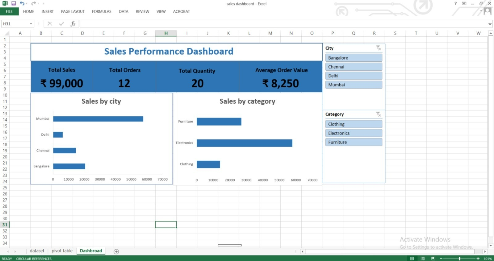
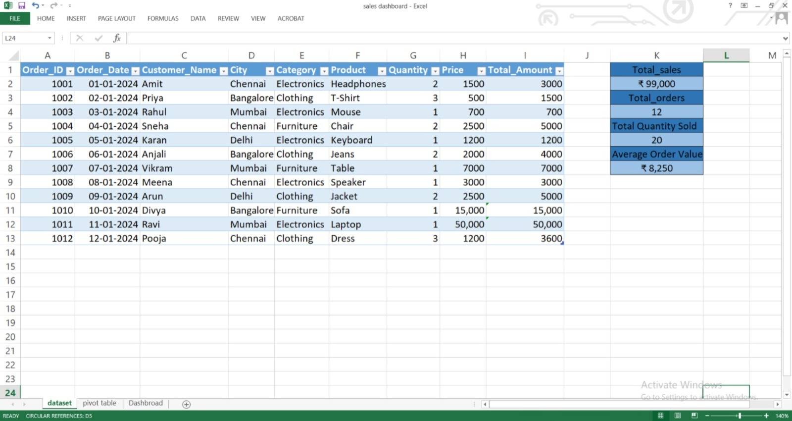

 📊 Sales Performance Dashboard (Excel)

🔍 Project Overview

This project showcases the process of transforming raw sales data into meaningful insights using Microsoft Excel. It includes data cleaning, validation, analysis, and dashboard creation.

📊 Key Insights
- The West region generated the highest revenue
- Sales peaked during Q4, indicating seasonal demand
- Technology category contributed the most to total sales
- Average order value increased by X% over time

🧹 Data Cleaning

* Removed duplicate records
* Handled missing values
* Standardized inconsistent text (city names, formatting)
* Validated and corrected incorrect total values

📊 Dashboard Features

* KPI Cards:

  * Total Sales
  * Total Orders
  * Total Quantity
  * Average Order Value
* Sales analysis by City and Category
* Interactive filters using Slicers

📈 Key Insights

* Mumbai generated the highest sales, indicating strong demand
* Electronics is the top-performing category
* Delhi and Clothing category showed comparatively lower performance

🛠️ Tools Used

* Microsoft Excel
* Pivot Tables
* Slicers
* Data Cleaning Techniques

📸 Dashboard Preview

 🚀 What I Learned

* Importance of data cleaning before analysis
* How to build interactive dashboards
* Converting raw data into business insights

🔗 Future Improvements

* Build the same dashboard using Power BI
* Perform deeper analysis using SQL

